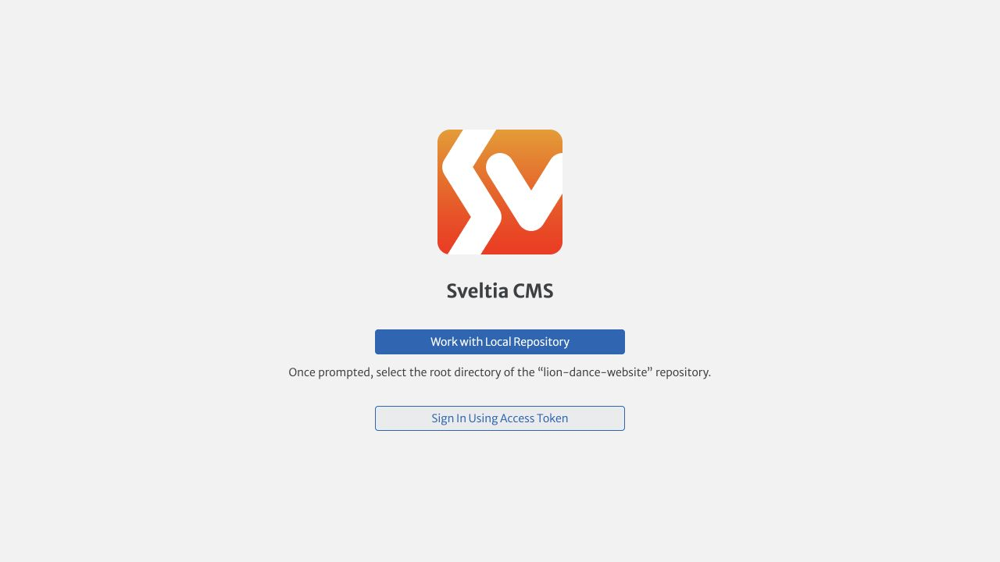

# 管理員圖片操作指南

> 後台入口：<https://nansiengtaiwan.com/admin/>  
> 適用對象：負責新增、替換或調整網站演出照片的管理員  
> 建議收藏本頁與後台網址，之後不需要接觸程式碼。

## 30 秒快速流程

1. 開啟 [網站管理後台](https://nansiengtaiwan.com/admin/)。
2. 按 **Sign in with GitHub** 登入。
3. 左側選擇 **演出相簿**。
4. 選擇要修改的相簿。
5. 在 **相片** 區塊新增、替換、排序或移除照片。
6. 每張照片都填寫 **圖片替代文字**、寬度及高度。
7. 按 **Save / Publish** 發布。
8. 等候約 2 分鐘，再重新整理網站確認結果。

## 第一次登入

管理員需要：

- 一個 GitHub 帳號。
- 已被網站負責人加入網站 repository 的管理名單。
- 網站負責人已完成後台 OAuth 設定。

開啟後台後，按 **Sign in with GitHub**。如果只看到 Token 登入，請先聯絡網站技術管理者，不要自行建立或傳送 Token。

## 新增相簿照片

1. 從左側選單按 **演出相簿**。
2. 選擇照片所屬相簿，例如「開幕開工」或「春酒尾牙」。
3. 找到 **相片** 清單，按 **新增**。
4. 在 **大圖** 欄位上傳原始照片。
5. **縮圖**可以留白；系統會沿用大圖並在發布時自動產生適合網站的 WebP 尺寸。
6. 填寫圖片資料：
   - **圖片替代文字**：描述人物、表演與場合。
   - **圖片寬度**：原圖的像素寬度。
   - **圖片高度**：原圖的像素高度。
7. 按 **Save / Publish**。

替代文字範例：

- 好：`紅色醒獅在公司開幕舞台進行採青表演`
- 好：`南仙戰鼓團在百貨春節活動舞台演出`
- 不好：`照片1`、`活動照片`、檔案名稱

## 查詢照片寬度與高度

上傳前可在電腦查看：

- macOS：在 Finder 選取照片，按 `Command + I`，查看「更多資訊 → 尺寸」。
- Windows：在檔案上按右鍵，選「內容 → 詳細資料」，查看寬度與高度。
- 手機：在照片資訊或詳細資料中查看解析度，例如 `3024 × 4032`。

第一個數字填「圖片寬度」，第二個數字填「圖片高度」。

## 替換照片

1. 開啟 **演出相簿**，選擇相簿。
2. 找到要替換的相片項目。
3. 在 **大圖**欄位選擇或上傳新照片。
4. 更新替代文字、寬度與高度。
5. 按 **Save / Publish**。

發布前請確認新照片方向正確，人物沒有被裁掉。

## 調整照片順序

在 **相片** 清單中拖曳項目，將最重要、最清楚的照片放在前面，再按 **Save / Publish**。

建議第一張使用：

- 主體清楚、光線良好的橫式照片。
- 能看出活動場合與表演內容的照片。
- 沒有浮水印、聊天截圖或大面積空白的照片。

## 移除照片

1. 在相片項目旁按刪除或移除。
2. 確認相簿內至少保留一張照片。
3. 按 **Save / Publish**。

注意：從相簿清單移除照片，不一定會刪除媒體庫中的原始檔。若要永久刪除媒體檔，請先確認其他頁面沒有使用該照片；不確定時請交給技術管理者處理。

## 更換「服務項目」圖片

1. 從左側選單按 **服務項目 → 表演項目列表**。
2. 展開要修改的表演項目。
3. 更換 **720px 圖片**與 **1440px 圖片**。
4. 更新 **圖片替代文字**、原始寬度與原始高度。
5. 不要修改 **錨點 ID**。
6. 按 **Save / Publish**。

服務項目目前需要小圖與大圖兩個檔案。若手上只有一張未壓縮原圖，請先交給技術管理者產生 720px 與 1440px 版本，避免手機載入過慢。

## 建議的圖片規格

- 格式：JPG、PNG 或 WebP。
- 長邊建議：1920px 左右；超大原圖可直接上傳到相簿，建置時會限制輸出尺寸。
- 單張檔案建議小於 10MB。
- 避免上傳 LINE 或通訊軟體重複壓縮過的模糊圖片。
- 不要上傳含有個資、未授權人物或未取得使用權的照片。

## 發布後如何確認

1. 發布後等待約 2 分鐘。
2. 開啟對應的網站相簿頁。
3. 重新整理頁面；若仍看到舊圖，可使用無痕視窗再確認。
4. 點開照片，確認大圖、順序與替代文字對應正確。
5. 同時用手機查看，確認載入與裁切正常。

## 常見問題

### 登入後看不到「演出相簿」

先登出再登入。若仍看不到，請網站負責人確認你的 GitHub 帳號已加入 repository。

### 按發布後網站沒有更新

先等待 2–5 分鐘並重新整理。仍未更新時，請截圖後台畫面，交給技術管理者查看 Netlify 部署紀錄；不要連續重複發布。

### 圖片上傳失敗

確認檔案是 JPG、PNG 或 WebP，檔名不要含特殊符號，並縮短檔名後重試。仍失敗時保留原圖並聯絡技術管理者。

### 圖片方向錯誤

先在手機或電腦旋轉並另存新檔，再重新上傳；不要只依賴相簿 App 的顯示方向。

### 可以一次刪除很多圖片嗎？

不建議。先少量修改並發布確認，避免誤刪其他頁面正在使用的圖片。

## 發布前檢查表

- [ ] 照片放在正確相簿。
- [ ] 圖片方向正確、畫面清楚。
- [ ] 替代文字具體描述表演與場合。
- [ ] 寬度與高度填寫正確。
- [ ] 沒有修改系統代碼或錨點 ID。
- [ ] 發布後已用桌機與手機確認。

其他內容修改請參考 [`EDITOR_GUIDE.md`](EDITOR_GUIDE.md)。登入設定由技術管理者參考 [`OAUTH_SETUP.md`](OAUTH_SETUP.md)。
